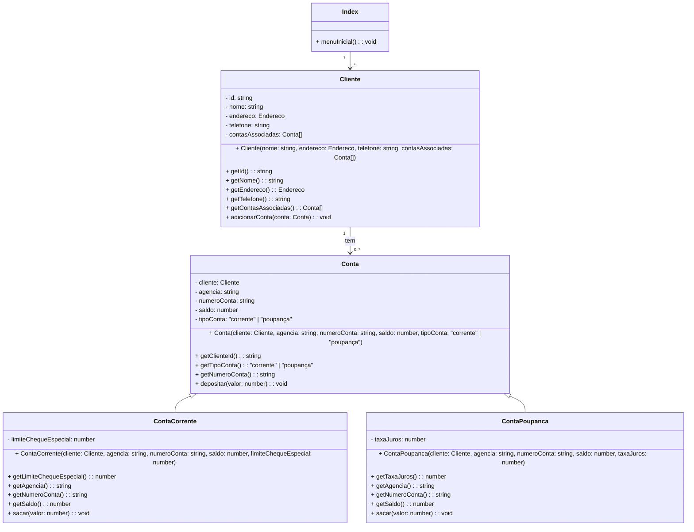

# on32-ijs-projeto-banco-comunitario

## Instruções de projeto
Você deve criar classes e interfaces apropriadas para representar clientes, suas contas bancárias e implementar métodos para interagir com esses dados, como criar uma nova conta para um cliente, depositar, sacar, transferir dinheiro entre contas, etc.

### Requisitos:

#### Cada cliente do banco deve ter as seguintes informações:
- Nome completo
- Número de identificação (ID)
- Endereço
- Número de telefone 

#### Requisitos de negócio:
- Cada cliente pode ter uma ou mais contas bancárias. As contas podem ser do tipo Conta Corrente ou Conta Poupança.
  - Para a conta corrente, é necessário armazenar o limite do cheque especial.
  - Para a conta poupança, é necessário armazenar a taxa de juros.
  
## Detalhes da implementação
Utilizei o módulo readline do Node.js para criar uma interface de linha de comando interativa. O readline permite que façamos perguntas ao usuário e capturemos suas respostas, proporcionando uma maneira simples e eficaz de interagir com o programa através do terminal.

Fiz um diagrama para explicar melhor o funcionamento do projeto.

Uma explicação resumida do projeto:
- **Cliente.ts**: Representa um cliente do banco, com atributos como nome, endereço, telefone e uma lista de contas associadas. Ele pode ter várias contas.

- **Conta**: Representa uma conta bancária, com atributos como cliente associado, agência, número da conta, saldo e tipo de conta (corrente ou poupança). Possui métodos para depositar dinheiro e obter informações da conta.

- **ContaCorrente e ContaPoupanca**: São tipos específicos de conta que herdam de Conta. ContaCorrente tem um atributo adicional para o limite do cheque especial e métodos específicos para sacar dinheiro. ContaPoupanca tem um atributo para a taxa de juros e métodos específicos para sacar dinheiro.

- **Index**: Representa o ponto de entrada do sistema, com um método menuInicial() para apresentar o menu inicial ao usuário.