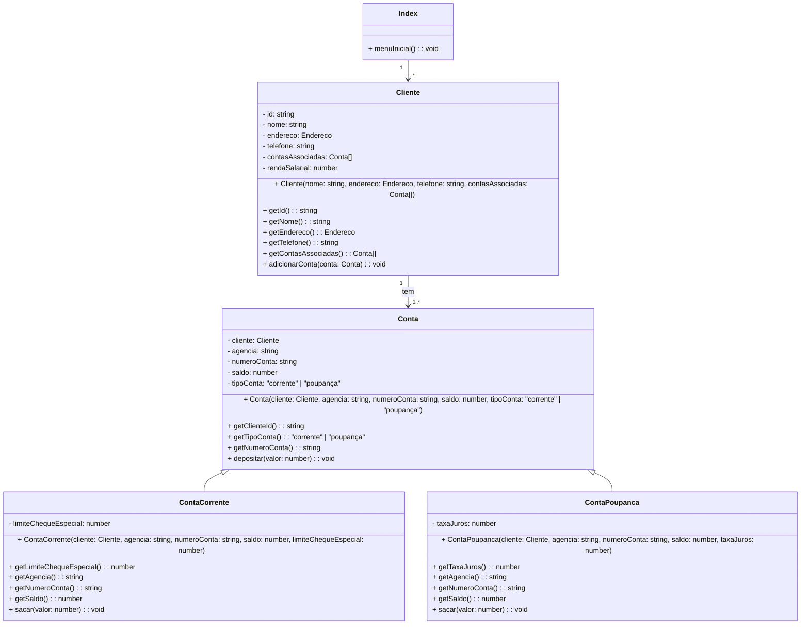

# on32-ijs-projeto-banco-comunitario

## Instruções de projeto
Você deve criar classes e interfaces apropriadas para representar clientes, suas contas bancárias e implementar métodos para interagir com esses dados, como criar uma nova conta para um cliente, depositar, sacar, transferir dinheiro entre contas, etc.

### Requisitos:

#### Cada cliente do banco deve ter as seguintes informações:
- Nome completo
- Número de identificação (ID)
- Endereço
- Número de telefone 

#### Requisitos de negócio:
- As contas podem ser do tipo Conta Corrente ou Conta Poupança.
  - A partir de R$ 500,00 o cliente pode ter uma conta corrente. 
  - Para a conta corrente, é necessário armazenar o limite do cheque especial(R$ 100,00).
  
## Detalhes da implementação
Utilizei o módulo readline do Node.js para criar uma interface de linha de comando interativa. O readline permite que façamos perguntas ao usuário e capturemos suas respostas, proporcionando uma maneira simples e eficaz de interagir com o programa através do terminal.

Fiz um diagrama para explicar melhor o funcionamento do projeto.

Uma explicação resumida do projeto:
- **Cliente.ts**: Representa um cliente do banco, com atributos como nome, endereço, telefone, uma lista de contas associadas e a renda salarial. Ele pode ter várias contas.

- **Conta**: Representa uma conta bancária, com atributos como cliente associado, agência, número da conta, saldo e tipo de conta (corrente ou poupança). Possui métodos para depositar dinheiro e obter informações da conta.

- **ContaCorrente e ContaPoupanca**: São tipos específicos de conta que herdam de Conta. ContaCorrente tem um atributo adicional para o limite do cheque especial e métodos específicos para sacar dinheiro. ContaPoupanca tem um atributo para a taxa de juros e métodos específicos para sacar dinheiro.

- **Index**: Representa o ponto de entrada do sistema, com um método menuInicial() para apresentar o menu inicial ao usuário.

## Funções: 
Utilizei funções para que o usuário possa utilizar o sistema. 

- menuInicial (index.ts) - A função menuInicial é a porta de entrada do sistema bancário, apresentando um menu interativo para os usuários.

- novoCliente (cliente.ts) - A função novoCliente é responsável por cadastrar um novo cliente no sistema. Após coletar todos os dados necessários, um novo objeto Cliente é criado com essas informações. O novo cliente é adicionado à lista de clientes (clientesDoBanco). Após o cadastro, o usuário é perguntado se deseja abrir uma conta. Se sim, a função novaConta é chamada.

- conferirCliente (cliente.ts) -  A função solicita o ID do cliente e busca esse ID na lista de clientes (clientesDoBanco). Se o cliente for encontrado, a função exibe as contas associadas ao cliente e chama menuContas para permitir operações na conta. Se o ID não for encontrado, uma mensagem informando que o cliente não foi encontrado é exibida.

- novaConta (conta.ts) - O usuário escolhe entre abrir uma conta corrente ou uma conta poupança. A agência é definida como "0001" e o número da conta é gerado aleatoriamente com 8 caracteres. Se o tipo de conta for "corrente", a renda salarial do cliente deve ser de pelo menos R$ 500,00. A conta é criada e adicionada ao cliente. Uma mensagem de sucesso é exibida.

- menuContas (conta.ts) - A função menuContas permite que o cliente escolha entre visualizar suas contas correntes ou poupanças. Dependendo da escolha do usuário, a função encontra a conta correspondente e exibe suas informações, ou retorna ao menu inicial se o usuário escolher voltar.

- menuOperacoes (conta.ts) - A função apresenta um menu com opções para depositar, sacar ou transferir dinheiro entre contas.

- depositar (conta.ts) - A função solicita o valor do depósito.  Verifica se o valor é válido e positivo. Efetua o depósito na conta e exibe uma mensagem de sucesso.

- sacar (conta.ts) - A função sacar permite que o cliente saque dinheiro de uma conta corrente. A função solicita o valor do saque. Verifica se o saldo da conta é suficiente para o saque ou se pode utilizar o limite do cheque especial. Efetua o saque e exibe uma mensagem de sucesso.

- sacarPoupanca (conta.ts) - Parecida com a função sacar, mas sem poder usar o limite do cheque especial. 

- transferirContaCorrente (conta.ts) -  Permite que o cliente transfira dinheiro de uma conta corrente para outra conta. A função solicita o número da conta de destino e o valor da transferência.Verifica se o saldo da conta é suficiente para a transferência ou se pode utilizar o limite do cheque especial.
Efetua a transferência e exibe uma mensagem de sucess

- transferirPoupanca (conta.ts) - Parecida com a função transferirContaCorrente, mas sem poder usar o limite do cheque especial.

- exibirContaCorrente (contaCorrente.ts) e exibirContaPoupanca (contaPoupanca.ts) - exibem as informações das contas para o clinete. exibirContaCorrente exibe agência, número da conta, saldo e o limite do cheque especial. ContexibirContaPoupanca exibe agência, número da conta, saldo e taxa de juros.